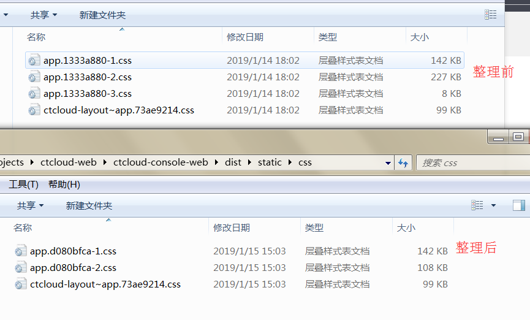

### 公共代码多次放在scoped内
我们很多时候写了一个公共的common.scss,然后在各个vue里面

```scss
<style scoped>
import  '@/assets/css/common.scss'
</style>
```
由于加了scoped，导致common里面的样式都加上了``[data-v-aaaa]``这样的标识，最后打出来的css重复，这就不是公共css了。

并且在多少个vue里面import就会打包多少次common.scss进去，最后导致css打出来很大。

### 公共代码多次放在scoped外
下面的代码打包出来只会有一份global.scss，也就是不会重复打包。所以为了方便，直接在main.js引入一次就够了
```scss
//a.vue
<style >
@import '@/assets/css/global.scss'
</style>
```

```scss
//b.vue
<style >
@import '@/assets/css/global.scss'
</style>
```

### 公共代码放scoped外，自定义代码放scoped内
 为了不重复打包，那我把公共的css代码拿出来不放在scoped里面不就好了。

```scss
//global.scss
.white{ color:#fff}
```

```scss
//a.vue
<style >
@import '@/assets/css/global.scss'
</style>
```
但是下面这个情况不行，运行会报错：``$white is not defined``
```scss
// variable.scss
$white:#fff;
```

```scss
//a.vue
<style >
@import '@/assets/css/variable.scss'
</style>
<style scoped>
.white{
    color:$white;
}
<style/>
```
然后试了一下
```scss
<style scoped>
@import '@/assets/css/variable.scss'
.white{
    color:$white;
}
</style>
```
发现打出来的css里面变量$white直接编译成#fff了，打包后的css里面找不到$white,所以就不用担心会重复打包这些变量了。


### IE浏览器对css的约束
 之前控制台中心在IE9浏览器下样式混乱。说是IE浏览器对css有些约束

[Stylesheet Limits in Internet Explorer](https://blogs.msdn.microsoft.com/ieinternals/2011/05/14/stylesheet-limits-in-internet-explorer/)

[参考博客](https://blog.csdn.net/napoleonxxx/article/details/80292006)

然后用了下面两个插件解决。好像也可以设置splitChunk解决，不过试了效果不太满意，后面再继续探究。
```js
optimization: {
    minimizer: [
    new CSSSplitWebpackPlugin({
        size: 4000,
        filename: path.posix.join(assetsDir,'css/[name]-[part].[ext]'),
        }),  
    new OptimizeCSSAssetsPlugin({
        assetNameRegExp: /\.css$/g,
        cssProcessor: require('cssnano'),
        cssProcessorOptions: { discardComments: {removeAll: true },reduceIdents:false },
        canPrint: true
    }),             
    ]
},
```


## 总结：
1. 把css变量单独拎出来做一个文件variable.scss，在vue的``<style scoped>``里@import使用
2. 公共css文件在main.js里面直接import一次就好，不要再在其他vue里面import
3. 多人协作防止冲突，各组件的公共css文件我觉得可以在外面用一个自己的class包裹起来。例如

```js
//main.js
import '@/views/order/style.scss';
```

```scss
//@/views/order/style.scss
.order{
    xxxxx
}
```

最后把控制台的代码按照上面的方法整理了一下，结果打包出来的css足足小了127kb


------------2019/2/19更新-------------------

注意：之前在想，既然``<style></style>``(不用scoped)放在哪里都可以全局生效，那我随便放在一个大组件里也行啊。
最近发现在一个组件里面不用scoped地引入css,从这个组件进去另一个组件，另一个组件确实是会受到前者css的影响。
但是如果直接打开后者组件的页面，不经过前者，css无效。所以全局css还是放在main里面好。


